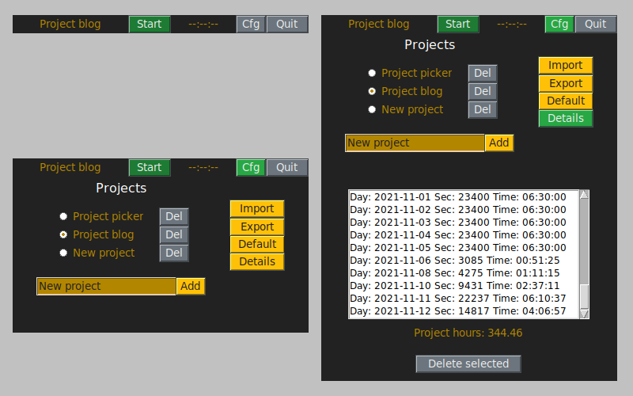

# Working timer
A simple time-tracker app that shows how much your worked. Written in Python.  
  

## Features
- Add/remove/switch projects.
- Show detailed data for the project.
- Remove date fields from the project.
- Import/export projects data.
- Set default project for a startup.

## Notes
Because of simplicity, data is saved in a pickle binary file.  
Switching project saves previous project time.  
By default import/export filetype is text, lines format: "project name,
date iso, seconds".
